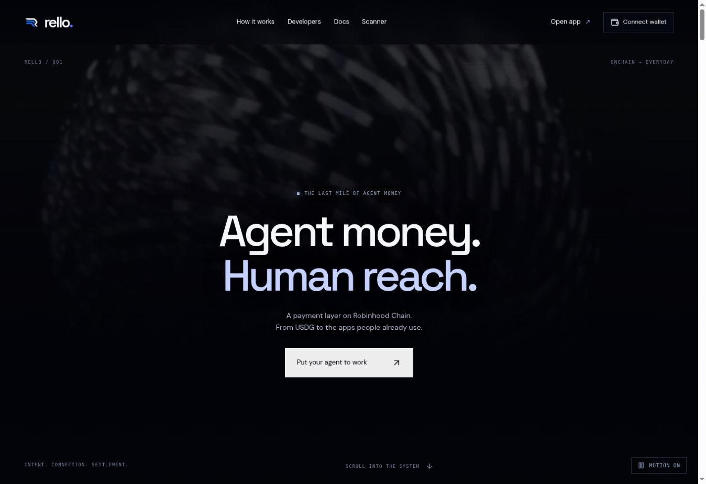

<a href="https://avero.ft5566942.chatgpt.site"></a>

<h1 align="center">Rello</h1>
<p align="center"><strong>Agent money. Human reach.</strong></p>
<p align="center">The last mile between an agent’s wallet and everyday payment apps.</p>

<p align="center">
  <a href="https://avero.ft5566942.chatgpt.site">Open Rello</a> &nbsp; / &nbsp;
  <a href="https://avero.ft5566942.chatgpt.site/docs">Product docs</a> &nbsp; / &nbsp;
  <a href="docs/GETTING_STARTED.md">Get started</a> &nbsp; / &nbsp;
  <a href="docs/ARCHITECTURE.md">Architecture</a>
</p>

<p align="center">
  <a href="https://github.com/RelloDeveloper/Rello-Protocol/actions/workflows/build.yml"></a>
  <a href="https://github.com/RelloDeveloper/Rello-Protocol/actions/workflows/typecheck.yml"></a>
  <a href="https://github.com/RelloDeveloper/Rello-Protocol/actions/workflows/holder-access.yml"></a>
  <a href="https://github.com/RelloDeveloper/Rello-Protocol/actions/workflows/sdk.yml"></a>
  <a href="https://github.com/RelloDeveloper/Rello-Protocol/actions/workflows/http-api.yml"></a>
  <a href="https://github.com/RelloDeveloper/Rello-Protocol/actions/workflows/mcp.yml"></a>
  <a href="https://github.com/RelloDeveloper/Rello-Protocol/actions/workflows/markets.yml"></a>
  <a href="https://github.com/RelloDeveloper/Rello-Protocol/actions/workflows/repository.yml"></a>
</p>

Rello brings payment planning, runner participation, wallet reads and agent integrations into one interface on Robinhood Chain. An agent sets the intent; the payment model assigns an independent runner to carry it into an everyday payment app; USDG is the proposed settlement asset.

**One intent, familiar destinations** — Twenty payment rails, including PayPal, Zelle, Venmo, Cash App, Revolut, Wise, Pix and bank transfers, with recognizable brand marks.

**A wallet-first workspace** — Connect before entering the account. Transaction tools require **more than $150 worth of $RELLO**, with a fresh holdings check before each attempted action.

**An interface for agents** — A downloadable JavaScript client, HTTP endpoints and six MCP tools share the same payment vocabulary and transaction boundaries.

**A public footprint reader** — Read a Robinhood Chain address’s balances, recent activity and counterparties without requesting a signature.

## Explore the code

| Area | What is included |
| --- | --- |
| Entrance | Animated brand lettering, four moving panels, a clean transition into the cinematic homepage |
| Homepage | Video atmospheres, scroll choreography, payment-rail streams and an interactive payout narrative |
| Account | Overview, pay, receive, move, agents and runner workspaces |
| Wallet | EIP-6963 wallet discovery, provider restoration through `eth_accounts`, account-change and disconnect handling |
| Holder access | Exact integer arithmetic for the strict $150 threshold; missing deployment or price data keeps access locked |
| Public data | Robinhood Chain RPC balances, Blockscout exposure reads and USDG-quoted markets from DEX Screener |
| Integrations | HTTP SDK and JSON-RPC MCP endpoint with structured errors |
| Verification | Eight CI workflows covering build, types, access, SDK, HTTP, MCP, markets and repository integrity |

## How a payment is modeled

1. **Set intent** — Choose the destination, amount, deadline and runner-fee cap.
2. **Assign a runner** — A runner accepts the request using an eligible payment rail.
3. **Fund escrow** — The model reserves USDG principal plus the agreed fees.
4. **Send the everyday payment** — The runner pays from their own account and supplies proof.
5. **Confirm or dispute** — Release reimbursement after receipt, or use the dispute/refund path.

These are protocol-design states. This repository contains the interface and read APIs; it does not contain a deployed escrow contract or a live fiat settlement service. The write handlers return a structured unavailable response, never a fabricated transaction hash.

## How access is checked

1. The browser obtains the account directly from the selected wallet provider.
2. The access endpoint validates the address and reads the confirmed token contract.
3. Holdings are valued against the deepest available Robinhood Chain market for that token.
4. The gate compares value against $150 with integer arithmetic. Exactly $150 does not unlock access.
5. Every attempted transaction checks the wallet account again and refreshes eligibility.

The $RELLO token address has not been configured in this source. Until the project owner confirms it, eligibility stays locked. The holder gate is an interface access rule, not a guarantee of backend authorization or a claim that a settlement service is deployed.

## Integrate

```js
import { createRelloClient } from './public/rello-client.mjs';

const rello = createRelloClient({
  origin: 'https://avero.ft5566942.chatgpt.site'
});
const { rails, caps } = await rello.rails();
console.log(rails, caps);
```

Read [HTTP and MCP interfaces](docs/API.md) before implementing payment actions. Public reads require no API key; production write authorization and settlement are separate work.

## Run locally

Use **Node.js 22.13+** and **pnpm 11.25.0**.

```sh
corepack enable
corepack prepare pnpm@11.25.0 --activate
pnpm install --frozen-lockfile
pnpm dev
```

Open **http://localhost:5173**.

```sh
pnpm typecheck    # TypeScript verification
pnpm test         # All behavioral and repository tests
pnpm build        # Production application build
```

Public reads depend on the RPC, explorer and market provider being reachable. No private key, recovery phrase, funded wallet or paid API key is needed to run these checks. See [Getting started](docs/GETTING_STARTED.md) for deployment details.

## Continuous integration

Each workflow runs on pushes to `main`, pull requests and manual dispatch. Workflows fail when checks fail; they do not mark themselves successful independently of their checks.

| Workflow | Verifies |
| --- | --- |
| [Production build](.github/workflows/build.yml) | The application compiles into production output |
| [TypeScript](.github/workflows/typecheck.yml) | Source and component type correctness |
| [Holder access](.github/workflows/holder-access.yml) | Strict threshold, fractional pricing and locked unconfigured access |
| [HTTP SDK](.github/workflows/sdk.yml) | Request methods, URL encoding and structured error propagation |
| [HTTP API](.github/workflows/http-api.yml) | Rail definitions, invalid-address handling, empty job states and rejected writes |
| [MCP tools](.github/workflows/mcp.yml) | Initialization, tool discovery, JSON-RPC errors and blocked transaction tools |
| [Market feed](.github/workflows/markets.yml) | Chain/quote filtering, deepest-pool selection, deduplication and empty data |
| [Repository integrity](.github/workflows/repository.yml) | Documentation links, icon files, model states and workflow definitions |

## Network and identity

| Item | Value |
| --- | --- |
| Project | Rello |
| Ticker | $RELLO |
| Network | Robinhood Chain |
| Configured chain ID | 4663 |
| Gas asset | ETH |
| Settlement-model asset | USDG |
| $RELLO contract | Not configured; owner-confirmed address required |

The chain settings are centralized in [`lib/chain.ts`](lib/chain.ts). USDG is separate from $RELLO; holding $RELLO is the proposed access requirement, not the payout principal.

## Current implementation

- Wallet discovery, the connected-account flow, read-only scanner, market normalization, payment planning and integration surfaces are implemented.
- Public balance and explorer data come from external providers; availability and returned history are provider-dependent.
- Stats and job lists begin at zero/empty. No completed payout history is manufactured.
- Funding, settlement, refunds, dispute execution, handle registration and one-time receiving-address generation are not connected to a deployed Rello protocol.
- HTTP payment writes return `503 / TRANSACTIONS_UNAVAILABLE`; MCP payment calls return `isError: true`.
- Encryption and receiving-account descriptions are protocol specifications, not implementations or privacy guarantees in this repository.
- CI verifies source behavior and compilation. Passing checks do not constitute a financial audit or prove funded end-to-end settlement.

## Repository map

```text
app/          Pages, styles and HTTP/MCP route handlers
components/   Wallet workspace, cinematic scenes and UI components
lib/          Chain readers, content, holder-access math and market processing
public/       Videos, brand marks and downloadable client
build/        Cloudflare-compatible build helpers and third-party notices
scripts/      Local development and build entry points
tests/        Behavioral checks and isolated provider-response fixtures
docs/         Setup, architecture, API and project screenshots
.github/      Eight verification workflows
```

## Contributions and rights

Read [CONTRIBUTING.md](CONTRIBUTING.md) before proposing a change. Sensitive issues belong in the private reporting process described in [SECURITY.md](SECURITY.md).

Rello is independent and is not affiliated with Robinhood or any named payment app. Payment-app trademarks identify destinations and belong to their owners. A project-wide license has not been selected; publishing this code is not a representation that it is MIT-licensed. Third-party notices remain in place. See [THIRD_PARTY_NOTICES.md](THIRD_PARTY_NOTICES.md).
